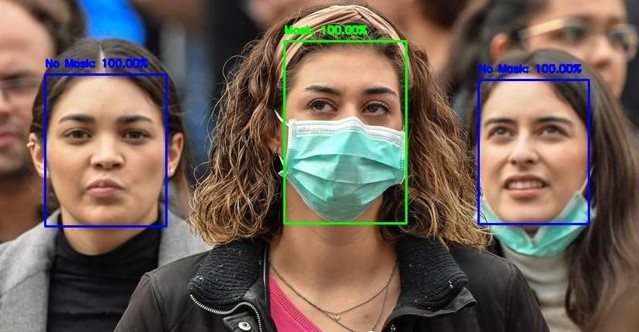

# Deployment_PROJECT (Face Mask Detector) Using Streamlit and Heroku
## by (Mohamed Sebaie Sebaie)

### \this is a simple Streamlit frontend for face mask detection in images using a pre-trained Keras CNN model (MobileNetV2) + OpenCV then deploy on heroku.

### The `Web Application` I Created, is in <a href="https://face-mask-detector-app-cv.herokuapp.com/" target="_blank">`This Link`</a>.
#### The Data used for training can be found through  <a href="https://www.kaggle.com/ashishjangra27/face-mask-12k-images-dataset" target="_blank">`This Link`</a> on Kaggle Website. 

#### All work here is done on `CoLab` 

## General Info
>- This example has been implemented by using OpenCV to detect faces in the input images and a a pre-trained Keras CNN model (MobileNetV2)   as mask/no-mask binary classifier applied to the faces Images. The Deep Learning model currently used has been trained using this image data set from kaggle <a href="https://www.kaggle.com/ashishjangra27/face-mask-12k-images-dataset" target="_blank">`here`</a> . The trained model has been shared in this repo. The face detector algorithm comes from <a href="https://github.com/opencv/opencv/blob/master/samples/dnn/face_detector/how_to_train_face_detector.txt" target="_blank">`here`</a>: the Caffee model files are in CAFFEE folder directory.

## Web APP Explanation
### Once an image has been uploaded, the classification happens automatically. 

##  About The Data:
#### The dataset used for Training consists of one zip file `Face Mask Dataset` that is download in `Colab` and unzipped then Create a pre-trained Keras CNN model (MobileNetV2) and Training then evaluate, save and test the model. The NoteBooks are in face_mask_detector_notebooks.

## Finally, After creating the ` Model` and save as `h5` file, Deploy the model with `Streamlit` frontend and upload it to`Heroku Platform`..

## The `Web Application` I Created, is in <a href="https://face-mask-detector-app-cv.herokuapp.com/" target="_blank">`This Link`</a>.

## Good Reference for Deployment a Streamlit Frontend to Heroku <a href="https://medium.com/analytics-vidhya/deploying-a-streamlit-and-opencv-based-web-application-to-heroku-456691d28c41" target="_blank">here</a>. 
